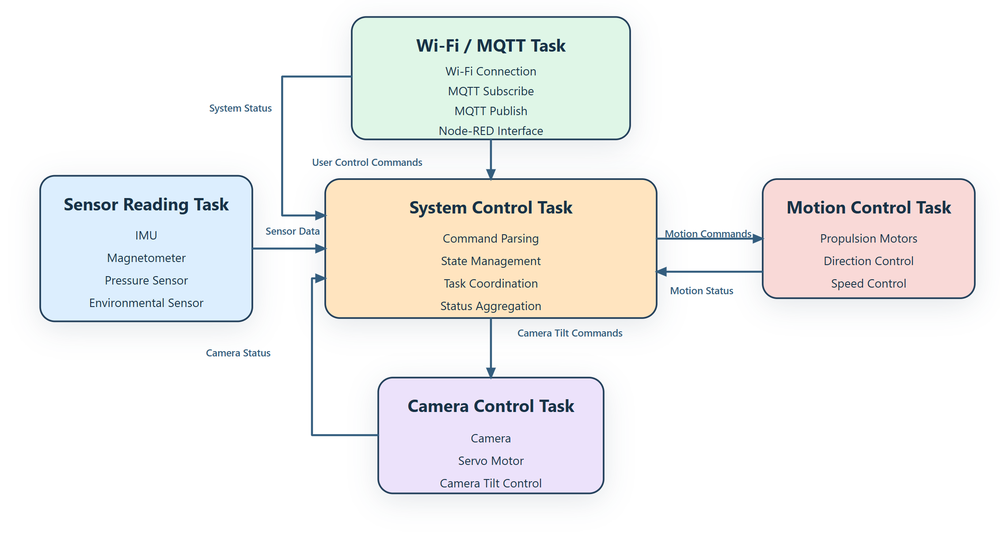
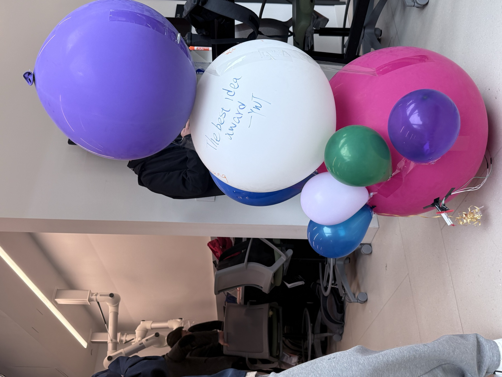
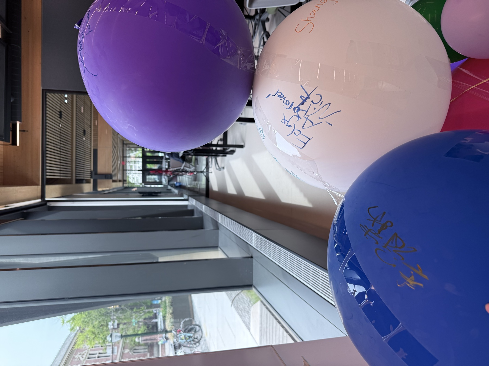
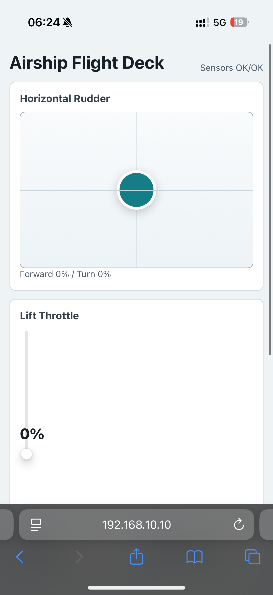
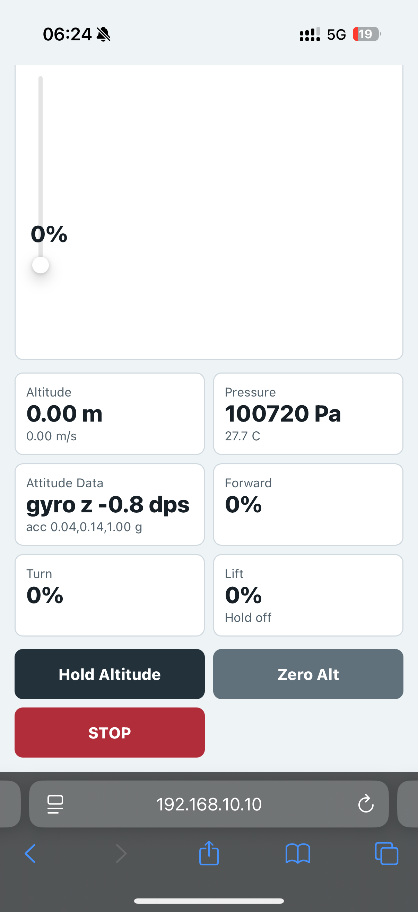
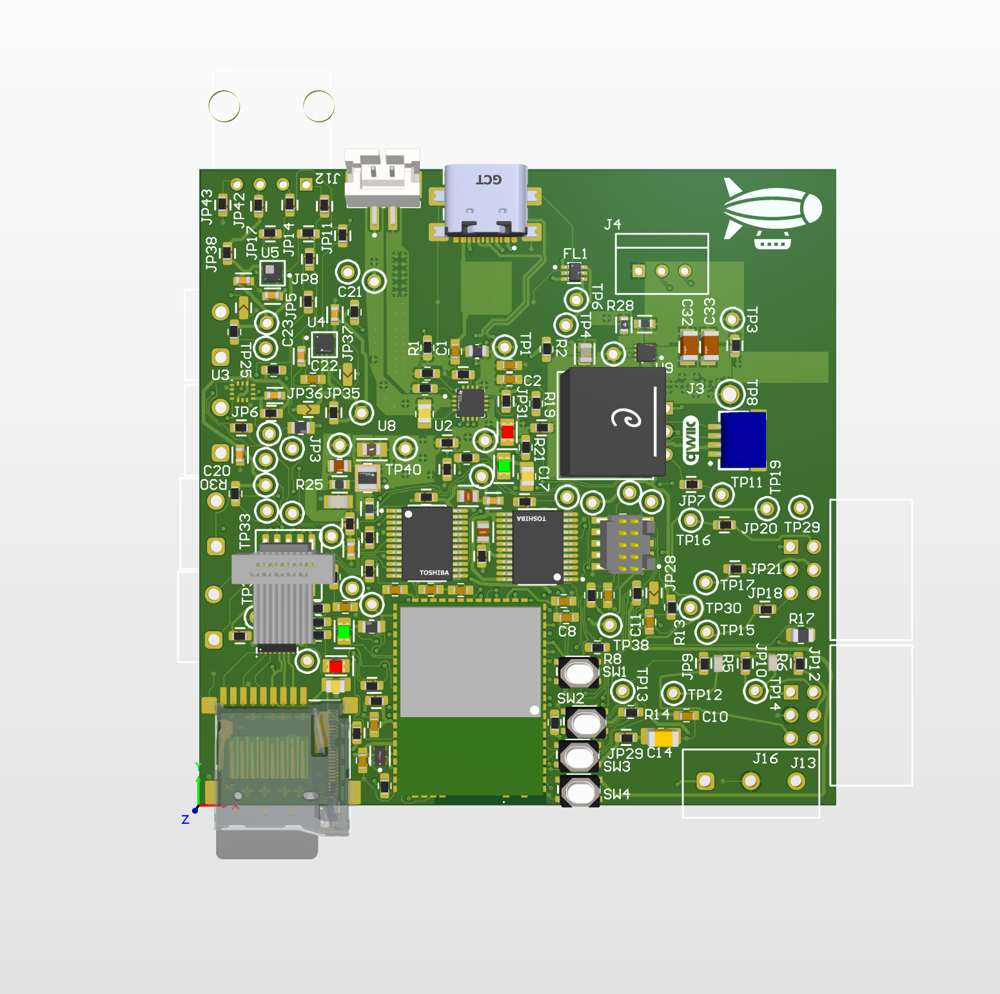
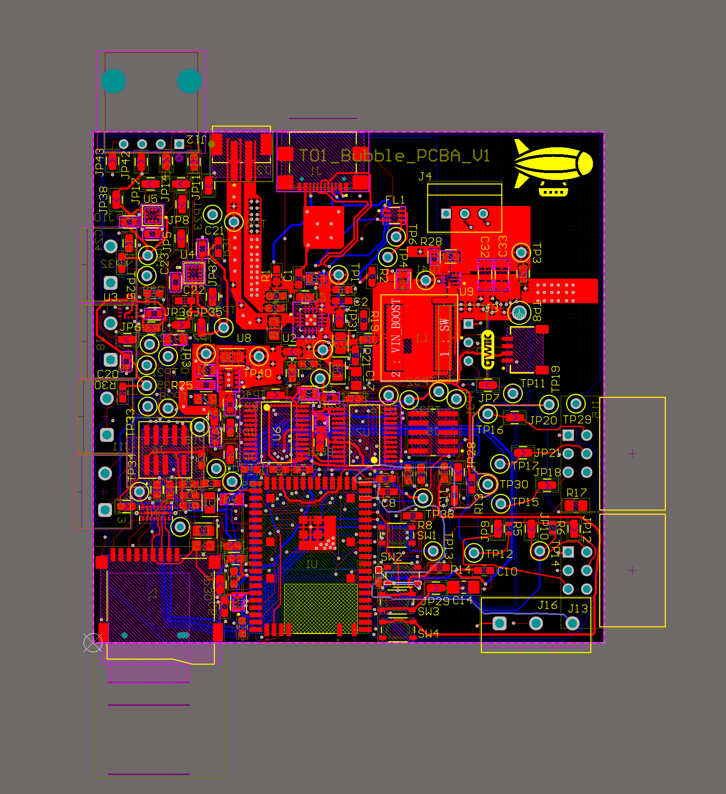

# A11G Final Submission

**Team Number:** 01

**Team Name:** Bubble

**A11G Repository URL:** <https://github.com/ese5160/a11g-final-submission-s26-s26-t01-bubble>

**Published GitHub Pages URL:** <https://chennn0224.github.io/a11g-final-submission-s26-s26-t01-bubble/>

| Team Member Name | Email Address | GitHub Handle |
| --- | --- | --- |
| Zhiyuan Chen | chennn@seas.upenn.edu | chennn |
| Mianzhi Wu | mzwu098@seas.upenn.edu | Max098Wu |

## 1. Video Presentation

Final YouTube video: <https://youtube.com/shorts/kgy-Gb3B5Gw?feature=share>

The final demo shows the tumbler-style prototype, the phone-based HTTP control page, live sensor telemetry, and motor response through the MCU-hosted Wi-Fi interface.

## 2. Project Summary

### Device Description

Team Bubble's final device is a Wi-Fi enabled self-balancing tumbler-style prototype that reads IMU and barometric sensor data and drives three motors from a SiWG917 MCU. A phone connects directly to the device Wi-Fi network and uses a browser-based HTTP page to control the motors while viewing live sensor telemetry.

The project was originally inspired by an airship concept for a small controllable floating platform. After testing the mechanical constraints of low-cost balloons, the final device pivoted to a tumbler platform that still solves the core integration problem: combining sensing, actuation, wireless communication, and mobile control in one embedded prototype.

The Internet-connected part of the system is local Wi-Fi plus HTTP. Instead of using Node-RED buttons or MQTT in the final build, the MCU creates a SoftAP named `Airship-917`, hosts an HTTP control page, accepts commands through URL endpoints, and returns live JSON telemetry through `/state`.

### Device Functionality

The final Internet-connected device is built around the SiWG917-family MCU running the `sl_si91x_i2c_driver_leader` firmware project. The firmware initializes the sensor task, motor driver, pressure/altitude control path, and HTTP server during startup.

Critical components:

- **MCU:** SiWG917-family board running the final embedded C firmware.
- **Sensors:** LSM6DSO IMU for acceleration and gyroscope data; BMP390 pressure sensor for pressure, temperature, estimated altitude, and vertical speed.
- **Actuators:** Three motor outputs controlled with direction GPIO pins and PWM duty cycle.
- **Wireless/UI:** MCU SoftAP plus embedded HTTP server; phone browser opens the control dashboard at the MCU IP address.
- **Firmware modules:** `app.c`, `airship_sensors.c`, `airship_control.c`, `motor_test.c`, and `web_control.c`.

The browser page sends motor and control commands through:

- `/cmd?m=<motor_index>&s=<signed_speed_percent>`
- `/hold?e=<0_or_1>&t=<target_altitude_cm>`
- `/zero`

The browser page reads live sensor/control data through:

- `/state`

The `/state` JSON includes IMU validity, barometer validity, altitude, vertical speed, pressure, temperature, acceleration, gyro Z, altitude-hold state, target altitude, and lift output.

System-level block diagram:

### Challenges

The original airship plan failed mainly because of mechanical and budget constraints. A custom shaped balloon was about $500, while the lower-cost party balloon option inflated into an irregular cone-like shape with an uneven mass and buoyancy distribution; that made stable flight control unrealistic for the remaining project schedule.

The firmware and integration challenges were also significant. Sensors, motors, Wi-Fi, the HTTP server, and the control page all had to run together on the same embedded target, and the earlier Node-RED/MQTT/camera plan introduced more moving parts than the final prototype needed.

We overcame these issues by narrowing the final system to a controllable tumbler prototype and simplifying the network path. Hosting the dashboard directly on the MCU reduced cloud dependencies and made the phone-to-device demo more reliable: connect to the MCU Wi-Fi, open the HTTP page, control motors, and view sensor data on the same page.

### Prototype Learnings

The main lesson was that mechanical feasibility has to be validated as early as firmware feasibility. The airship idea was not abandoned because sensing or wireless control was impossible; it was abandoned because the physical body could not be made stable within our budget and timeline.

If we built this again, we would validate the mechanical platform first, then design the firmware names and UI around the final device instead of carrying old `airship` naming into the code. We would also add a stronger IMU-based closed-loop controller and improve the motor mounting so each output maps more repeatably to physical motion.

### Next Steps & Takeaways

Steps to improve the project:

- Rename the remaining `airship` firmware symbols and UI text to match the tumbler device.
- Add a stronger IMU-based balancing controller.
- Improve the mechanical mount so the motors create more repeatable motion.
- Add SoftAP security or station-mode networking.
- Add a cleaner validation log for motor response and sensor readings.

Through ESE5160, we learned how quickly a prototype becomes a full system problem. The course-long project connected PCB design, firmware drivers, RTOS tasks, wireless networking, UI design, debugging, and mechanical constraints into one workflow; the biggest takeaway was that an IoT edge device only works when all of those layers are tested together.

### Project Links

- **GitHub Pages:** <https://chennn0224.github.io/a11g-final-submission-s26-s26-t01-bubble/>
- **Final YouTube demo:** <https://youtube.com/shorts/kgy-Gb3B5Gw?feature=share>
- **A11G submission repository:** <https://github.com/ese5160/a11g-final-submission-s26-s26-t01-bubble>
- **Final embedded C firmware:** <https://github.com/ese5160/final-project-firmware-s26-t01-bubble/tree/main/sl_si91x_i2c_driver_leader>
- **Node-RED review URL from earlier course dashboard work:** <https://organic-space-telegram-vppv7jvxj74h554-1880.app.github.dev/>
- **Node-RED / earlier dashboard code:** <https://github.com/ese5160/final-project-firmware-s26-t01-bubble/tree/main/Node-RED>
- **Node-RED final-use note:** The final prototype does not use Node-RED or MQTT for control; the final control surface is hosted directly by the MCU over HTTP.
- **Altium 365 PCBA share link:** <https://upenn-eselabs.365.altium.com/designs/48B7590E-3263-4D6A-AB1C-09D3A2993D19#design>

## 3. Hardware & Software Requirements Review

The table below reviews the earlier Airship HRS/SRS against the final burned firmware. Requirements tied to Node-RED, MQTT, camera, servo tilt, and cloud OTA are marked honestly because the final implementation uses MCU-hosted Wi-Fi and HTTP instead.

### HRS Review

| ID | Requirement | Status | Validation / Evidence |
| --- | --- | --- | --- |
| HRS-1 | Use a SiWG917-family MCU for sensor interfacing, wireless communication, and actuator control. | Met | Final burned project is `sl_si91x_i2c_driver_leader`; code initializes I2C, PWM/GPIO motors, and Wi-Fi. |
| HRS-2 | Support Wi-Fi connectivity for cloud communication, remote control, and OTA updates. | Partial | Wi-Fi remote control is met through SoftAP + HTTP. Cloud/OTA is not part of the final control path. |
| HRS-3 | Include an IMU and magnetometer for motion/orientation. | Partial | Final code uses LSM6DSO accelerometer/gyroscope. It does not use a magnetometer in the final burned project. |
| HRS-4 | Include a pressure sensor to estimate altitude. | Met | BMP390 pressure is compensated and converted into relative altitude. |
| HRS-5 | Include an environmental sensor. | Partial | BMP390 reports temperature and pressure. Earlier BME680 work existed, but final burned code uses BMP390 rather than full humidity/gas sensing. |
| HRS-6 | Include a camera for remote visual monitoring. | Not met | Camera integration was removed from the final path after the airship pivot. |
| HRS-7 | Include motors for movement control. | Met | `motor_test.c` implements three motor channels with direction GPIO and PWM. |
| HRS-8 | Include a servo motor for camera tilt. | Not met | No final camera tilt servo path is used. |
| HRS-9 | Include a speaker for audio output or alerts. | Not met | Speaker output was not included in the final prototype. |
| HRS-10 | Support OTA firmware update through a cloud-hosted image. | Partial | OTA was explored earlier, but the final demonstrated control firmware is the I2C/HTTP project. |

### SRS Review

| ID | Requirement | Status | Validation / Evidence |
| --- | --- | --- | --- |
| SRS-1 | Initialize and manage sensing, actuation, and communication peripherals. | Met | `app_init()` starts motors, sensor/control logic, and web control. |
| SRS-2 | Connect the device to Wi-Fi during startup. | Met | Final firmware starts its own SoftAP. |
| SRS-3 | Support MQTT communication between device and cloud. | Not met in final firmware | Final burned project uses HTTP, not MQTT. |
| SRS-4 | Subscribe to `airship/control/motion` and parse JSON motion commands. | Not met in final firmware | Final motion commands are HTTP query parameters at `/cmd?m=&s=`. |
| SRS-5 | Subscribe to camera tilt commands. | Not met | Camera tilt was removed from the final prototype. |
| SRS-6 | Control motion motors according to received commands. | Met | HTTP commands call `motor_test_set_signed_speed()`. |
| SRS-7 | Control camera tilt servo according to angle commands. | Not met | No final servo tilt command path is present. |
| SRS-8 | Publish system status information. | Partial | Status is not MQTT-published, but it is exposed as JSON through `/state`. |
| SRS-9 | Status data should include key system information. | Partial | Final JSON includes sensor validity, altitude, vertical speed, pressure, temperature, acceleration, gyro Z, hold state, target altitude, and lift output. |
| SRS-10 | Support OTA firmware update using a cloud-hosted image. | Partial | Earlier OTA work exists, but it is separate from final HTTP control functionality. |
| SRS-11 | Use multiple threads/tasks. | Met | Firmware creates a sensor task and a web server task with CMSIS-RTOS2/FreeRTOS. |
| SRS-12 | Use shared variables, queues, or event flags for inter-task communication. | Met | Sensor, control, and HTTP paths share structured state through `airship_sensor_state_t` and `airship_control_state_t`. |
| SRS-13 | Transmit live camera feed separately from MQTT. | Not met | Camera streaming was not implemented in the final prototype. |

## 4. Project Photos & Screenshots

Final prototype:

MCU-hosted HTTP dashboard:

Altium PCB screenshots:

## 5. Codebase

Final embedded C firmware:

- <https://github.com/ese5160/final-project-firmware-s26-t01-bubble/tree/main/sl_si91x_i2c_driver_leader>

Earlier Node-RED dashboard code:

- <https://github.com/ese5160/final-project-firmware-s26-t01-bubble/tree/main/Node-RED>

Important note: Node-RED was used in earlier course work, but it is **not** the final motor-control or sensor-transport path. The final device dashboard is hosted directly by the MCU over HTTP.
